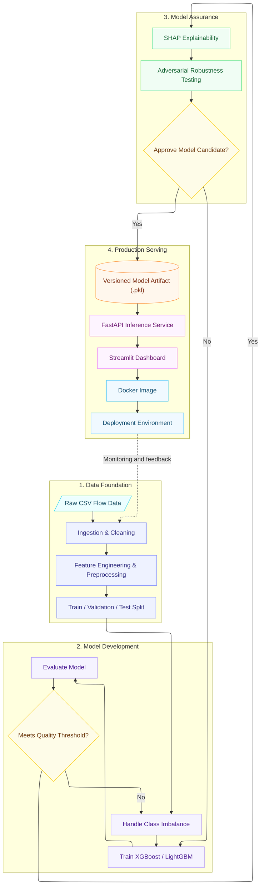

# Explainable Network Intrusion Detection System


A production-style network intrusion detection system using XGBoost/LightGBM with SHAP explainability, adversarial robustness testing, FastAPI inference, and Streamlit dashboard for real-time SOC threat analysis on CIC-IDS2017.

## Features

- **Multi-class classification** of network flows (benign, DoS, Probe, R2L, U2R, etc.)
- **SHAP explainability** integrated into training analysis and live API responses
- **Adversarial robustness test** with documented findings
- **FastAPI inference service** with batch scoring
- **Streamlit dashboard** for visualizing alerts + explanations
- **Dockerized** API + dashboard via `docker-compose`
- **Reproducible pipeline** with modular `src/` layout

## Architecture



## Quick Start

### Prerequisites

- Python 3.10+
- Docker & Docker Compose (for containerized run)

### 1. Clone & Install

```bash
git clone https://github.com/<your-username>/explainable-network-intrusion-detection.git
cd explainable-network-intrusion-detection
python -m venv venv
source venv/bin/activate  # Windows: venv\Scripts\activate
pip install -r requirements.txt
```

### 2. Download Dataset

Download the [CIC-IDS2017 dataset](https://www.unb.ca/cic/datasets/ids-2017.html) and place the CSV files in `data/raw/`. See `data/README.md` for details.

### 3. Run Training Pipeline

```bash
python -m src.models.train
python -m src.explainability.shap_explainer
```

### 4. Start API + Dashboard

```bash
docker-compose up --build
```

- API docs: http://localhost:8000/docs
- Dashboard: http://localhost:8501

## API Endpoints

| Method | Endpoint | Description |
|--------|----------|-------------|
| POST | `/predict` | Single flow prediction with SHAP explanation |
| POST | `/predict/batch` | Batch CSV scoring |
| GET | `/health` | Health check |
| GET | `/model/info` | Model version and metrics summary |

### Example Request

```bash
curl -X POST "http://localhost:8000/predict" \
  -H "Content-Type: application/json" \
  -d '{
    "features": {
      "flow_duration": 128473,
      "total_fwd_packets": 12,
      "total_bwd_packets": 8,
      "total_length_of_fwd_packets": 1200,
      "total_length_of_bwd_packets": 800,
      "fwd_packet_length_max": 250,
      "fwd_packet_length_min": 40,
      "bwd_packet_length_max": 200,
      "bwd_packet_length_min": 40,
      "flow_bytes_per_sec": 15000,
      "flow_packets_per_sec": 150,
      "flow_iat_mean": 500,
      "flow_iat_std": 100,
      "flow_iat_max": 800,
      "flow_iat_min": 100,
      "fwd_iat_total": 3000,
      "fwd_iat_mean": 250,
      "fwd_iat_std": 50,
      "fwd_iat_max": 400,
      "fwd_iat_min": 50,
      "bwd_iat_total": 2000,
      "bwd_iat_mean": 250,
      "bwd_iat_std": 50,
      "bwd_iat_max": 350,
      "bwd_iat_min": 50,
      "fwd_psh_flags": 0,
      "bwd_psh_flags": 0,
      "fwd_urg_flags": 0,
      "bwd_urg_flags": 0,
      "fwd_header_length": 240,
      "bwd_header_length": 160,
      "fwd_packets_per_sec": 75,
      "bwd_packets_per_sec": 50,
      "min_packet_length": 40,
      "max_packet_length": 250,
      "packet_length_mean": 100,
      "packet_length_std": 30,
      "packet_length_variance": 900,
      "fin_flag_count": 0,
      "syn_flag_count": 1,
      "rst_flag_count": 0,
      "psh_flag_count": 0,
      "ack_flag_count": 1,
      "urg_flag_count": 0,
      "cwe_flag_count": 0,
      "ece_flag_count": 0,
      "down_up_ratio": 0.67,
      "average_packet_size": 100,
      "avg_fwd_segment_size": 100,
      "avg_bwd_segment_size": 100,
      "fwd_header_length_2": 240,
      "bwd_header_length_2": 160,
      "subflow_fwd_packets": 12,
      "subflow_fwd_bytes": 1200,
      "subflow_bwd_packets": 8,
      "subflow_bwd_bytes": 800,
      "init_win_bytes_forward": 8192,
      "init_win_bytes_backward": 8192,
      "act_data_pkt_fwd": 12,
      "min_seg_size_forward": 20,
      "active_mean": 1000,
      "active_std": 200,
      "active_max": 1200,
      "active_min": 800,
      "idle_mean": 5000,
      "idle_std": 1000,
      "idle_max": 6000,
      "idle_min": 4000
    }
  }'
```

### Example Response

```json
{
  "prediction": "DoS Hulk",
  "confidence": 0.94,
  "is_malicious": true,
  "top_features": [
    {"feature": "flow_duration", "shap_value": 0.31},
    {"feature": "fwd_packet_length_max", "shap_value": 0.22},
    {"feature": "bwd_packets_per_sec", "shap_value": -0.11}
  ],
  "model_version": "v1"
}
```

## Project Structure

```
explainable-network-intrusion-detection/
├── README.md
├── requirements.txt
├── docker-compose.yml
├── Dockerfile.api
├── Dockerfile.dashboard
├── .gitignore
├── src/
│   ├── config.py
│   ├── data/          # Ingestion, cleaning, preprocessing
│   ├── features/      # Feature engineering & selection
│   ├── models/        # Training, evaluation, baselines
│   ├── explainability/# SHAP explainer, adversarial tests
│   └── api/           # FastAPI app, schemas, inference engine
├── dashboard/
│   ├── app.py
│   └── requirements.txt
├── notebooks/
├── models/
├── reports/
├── tests/
└── docs/
```

## Model Performance Targets

| Metric | Target |
|--------|--------|
| Macro F1-score | > 0.90 |
| Recall on minority attack classes | > 0.70 |
| False Positive Rate | < 5% |
| Inference latency (single flow) | < 200ms |
| SHAP explanation generation time | < 1s per prediction |

## Dataset

We recommend **CIC-IDS2017** as the primary dataset. Alternative datasets include NSL-KDD and UNSW-NB15.

- Store raw data in `data/raw/` (not committed to git).
- See `data/README.md` for download instructions.

## Future Work

- Graph Neural Network approach modeling network topology
- Live packet capture (Scapy/PyShark)
- Continuous retraining with drift detection
- Cross-dataset generalization testing

## License

MIT

## Contact

Built as a portfolio-grade advanced ML project targeting applied ML/security roles.
